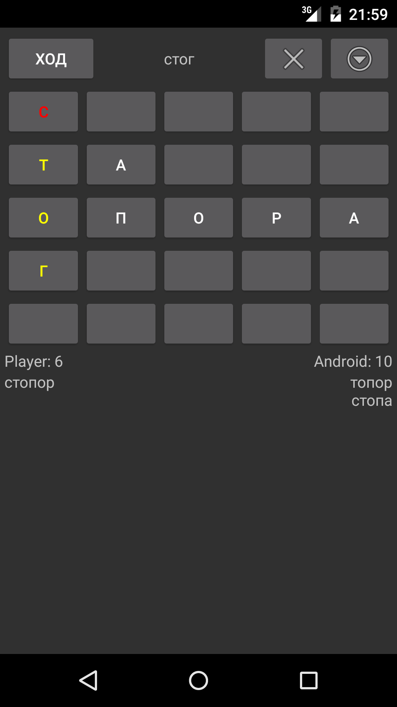

Балда RUS ENG
=============

Балда - лингвистическая настольная игра, в которой необходимо составлять слова с помощью букв, добавляемых определённым образом на квадратное игровое поле. Слова составляются посредством переходов от буквы к букве под прямым углом.
Особенности:
* выбор языка слов (русский, английский)
* портретный и ландшафтный режим игры
* перевод слов (для английского языка)
* подсказка (для английского языка)

Screenshots
-----------

License
-------
Copyright 2016 Chernyshov
